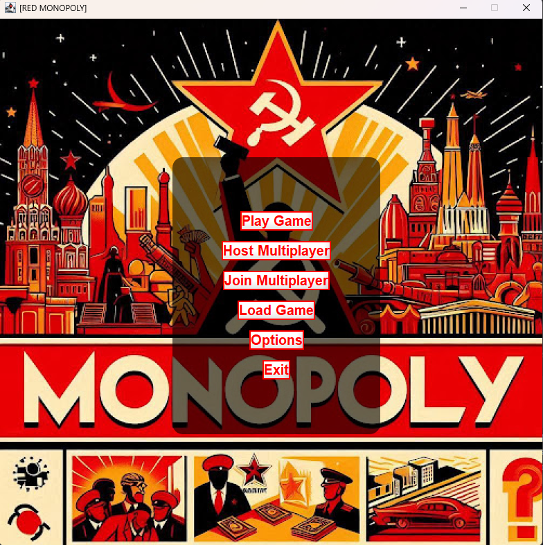
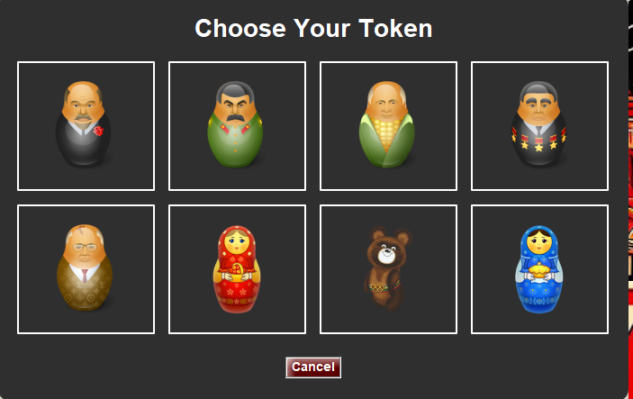
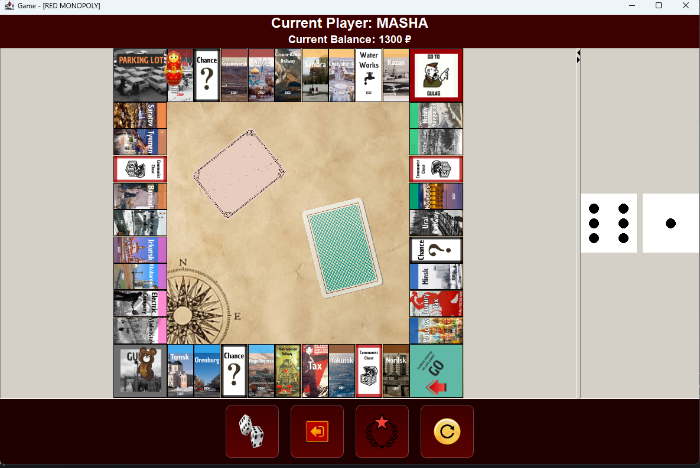
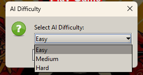
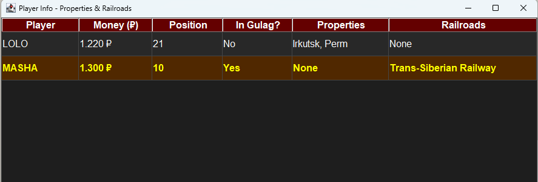
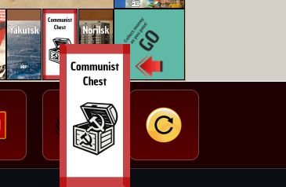
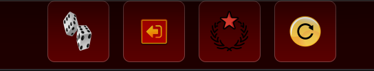

# Red Monopoly

A digital twist on the classic Monopoly board game, set in the USSR. Buy, trade, and build your way across the Soviet Union—from Moscow to Vladivostok—while managing five-year plans, factories, and political intrigue.

---

## Table of Contents

1. [User Manual & How to Play](#user-manual--how-to-play)  
2. [Project Configuration](#project-configuration)  
3. [Running the Game](#running-the-game)  
4. [Contributing](#contributing)  
5. [License](#license)  

---

## User Manual & How to Play

Below you will find the rules and features of Red Monopoly. Jump straight to any section:

- [Start a New Game](#start-a-new-game)  
- [Character Selection](#character-selection)  
- [Turn Sequence](#turn-sequence)  
- [Winning Conditions](#winning-conditions)  
- [Automatic Player](#automatic-player)  
- [It Is Not Your Game, It Is OUR Game!](#it-is-not-your-game-it-is-our-game)  
- [Additional Features](#additional-features)  

---

### Start a New Game

1. From the main menu, click **New Game**.  
2. Choose number of players (2–8) and an avatar per player.  
3. Click **OK** to place tokens on Red Square.

**Screenshot**:  


---

### Character Selection

1. After naming your player, you’ll see 8 Soviet-themed avatars.  
2. Click an avatar to select.  
3. Confirm to return to the main menu.

**Screenshot**:  


---

### Turn Sequence

1. **Roll Dice**: Click the **DICE** button.  
2. **Move Token**: Token advances automatically.  
3. **Resolve Space**:  
   - Buy property (if unowned).  
   - Pay rent (if owned).  
   - Draw a **Card** for special events.
   - If a player is Jailed, they cannot move unless they roll 2 dices that are the same value (E.G. 5 and 5). If they do not accomplish this in 3 turns, they will pay a Jail Fee and proceed normally.

**Screenshot**:  


---

### Winning Conditions

- **Elimination**: Bankrupt all other players.  

---

### Automatic Player

1. When prompted for a name, type `AI` to add a computer player.  
2. Set difficulty: `easy`, `medium`, or `hard`.  
3. The AI will take its turn automatically.

**Screenshot**:  


---

### It Is Not Your Game, It Is OUR Game!

– **Multiplayer Mode**:  
  - Do you want to play against your friends, or simply want bragging rights? Now you can do that in Red Monopoly with our multiplayer feature!
  - Host-Client architecture. One player hosts, others join via IP.  
  - Supports 2–8 players over LAN.

---

### Additional Features

- **Player Info Box**: Click the icon to view owned properties.
  

  

- **Tile Hints**: Hover over any tile for description and price.

  

- **Undo Move**: Click **Undo** to revert your last action.



---

## Project Configuration

1. **Prerequisites**  
   - Java 17 or higher  
   - Maven 3.x  
   - Git  

2. **Clone the repository**  
   ```bash
   git clone https://github.com/SwEng-UCM/red-monopoly.git
   cd red-monopoly
   ```

3. **Import into IntelliJ IDEA**  
   - Open IntelliJ IDEA and choose **File → Open…**  
   - Select the project’s root folder.  
   - IntelliJ will detect the Maven project and download dependencies.

4. **Build the JAR**  
   ```bash
   mvn clean package
   ```  
   This produces:
   ```
   target/monopoly-soviet.jar
   ```

---

## Running the Game

### A. From IntelliJ IDEA

1. In the **src** view, open `src/Launcher/Main.java` (or your main class).  
2. Click the green ▶️ run icon next to the `main` method. No launch parameters needed.
3. The game will start (GUI or embedded web server, depending on your setup).

### B. From the Command Line

1. Ensure you’ve built the JAR (`target/monopoly-soviet.jar`).  
2. Run:
   ```bash
   java -jar target/monopoly-soviet.jar
   ```
3. It is a desktop GUI, therefore the game window will appear automatically.

---

## Contributing

We welcome contributions! Please:

1. **Fork** the repo.  
2. **Create a branch**:
   ```bash
   git checkout -b feature/YourFeatureName
   ```
3. **Make your changes**, following the existing code style.  
4. **Commit** your work:
   ```bash
   git commit -m "Add feature: YourFeatureName"
   ```
5. **Push** to your fork:
   ```bash
   git push origin feature/YourFeatureName
   ```
6. Open a **Pull Request** against `main`.  

Please ensure your code builds (`mvn clean package`) and, if applicable, add or update tests.

---

## License

This project is licensed under the **MIT License**. See [LICENSE.md](LICENSE) for full details.
